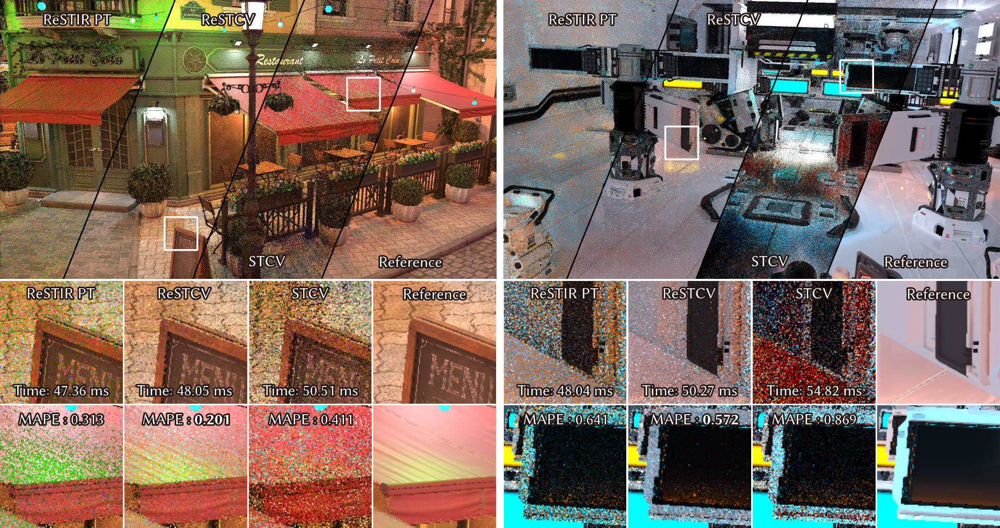
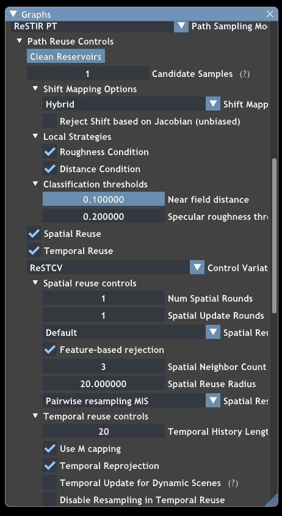
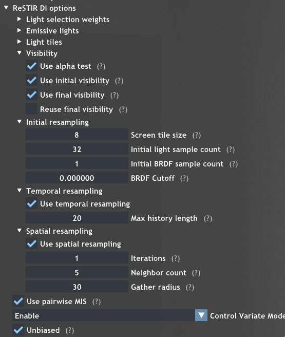

# ReSTCV



This repository contains the public release code for:

**Spatio-Temporal Control Variates with ReSTIR for Real-Time Rendering**
Zhong Shi, Cunhao Wu, Lifan Wu, Kun Xu
SIGGRAPH Conference Papers 2026 (Technical Paper Awards Honorable Mention)

- Project page: <https://hercier.github.io/restcv/>
- Paper DOI: <https://doi.org/10.1145/3799902.3811113>
- Base on Falcor Rendering framework/ ReSTIR PT implementation of Daqi Lin

ReSTCV extends ReSTIR path tracing with spatio-temporal control variates. Standard ReSTIR PT stores a representative path sample in each reservoir and shades mainly from that sample. ReSTCV additionally stores an accumulated color estimate in each reservoir, reuses correlated estimates from neighboring pixels and previous frames, and uses ReSTIR reservoir samples to estimate pixel differences. This reduces variance and visible color noise under low-sample real-time budgets.

## Main Files

- `Source/RenderPasses/ReSTIRPTPass`: the main ReSTIR PT and ReSTCV implementation.
- `Source/Falcor/Experimental/ScreenSpaceReSTIR`: the screen-space ReSTIR DI/GI module.
- `Source/RenderPasses/ScreenSpaceReSTIRPass`: the Falcor wrapper pass for screen-space ReSTIR.
- `Source/Mogwai/Data`: lightweight demo scripts and ablation scripts.

The main ReSTCV path is controlled by `ReSTIRCVMode.ReSTCV`. The comparison and ablation modes exposed in this release include `Disable` (normal ReSTIR), `STCV`, `Decoupled` (decoupled shading), and `ConstRatio` (constant alpha).

## Build Requirements

- Windows 10 20H2 or newer.
- Visual Studio 2022.
- Windows 10 SDK 10.0.19041.1 or newer.
- NVIDIA RTX GPU with ray tracing support.
- NVIDIA driver 466.11 or newer.
- NVAPI.

To install NVAPI, download it from <https://developer.nvidia.com/nvapi>, create `Source/Externals/.packman`, extract the SDK there, and rename the extracted `Rxxx-developer` folder to `nvapi`.

## Build

Open `Falcor.sln` in Visual Studio and build `ReleaseD3D12`.

The expected executable path after a successful build is:

```bat
Bin\x64\Release\Mogwai.exe
```

Please check out other readmes if you meet any problems.

## Quick Demo

Run:

```bat
RunReSTCVDemo.bat
```

This launches Mogwai with `Source\Mogwai\Data\ReSTIRPTDemo.py`. You can also run scripts manually, for example:

```bat
cd Source\Mogwai\Data\
..\..\..\Bin\x64\Release\Mogwai.exe --script=ReSTIRPTCV.py
```


## Controls





You may toggle between different methods with Control Variate Mode for ReSTIR DI or ReSTIR PT.  And spatial update rounds controls iteration of CV update. Note CV modes are applied seperately to PT and DI.

Other important updates on orginal repo: PT: now the small window size=0 correspond to 4-adjacent neighbors. DI: some detail implementation for unbiased temporal reuse may differ, and rejection strategy may differ.

## Implementation Notes

- Not every original ReSTIR PT configuration is expected to be compatible with current ReSTCV implementation.
- Especially,  the primary supported ReSTCV configuration uses pairwise MIS. Other ReSTIR MIS variants are not supported.

## Citation (will update when publication is ready)

```bibtex
@inproceedings{shi2026restcv,
  title     = {Spatio-Temporal Control Variates with ReSTIR for Real-Time Rendering},
  author    = {Shi, Zhong and Wu, Cunhao and Wu, Lifan and Xu, Kun},
  booktitle = {Special Interest Group on Computer Graphics and Interactive Techniques Conference Conference Papers (SIGGRAPH Conference Papers '26)},
  year      = {2026},
  doi       = {10.1145/3799902.3811113}
}
```


## License

The original ReSTIR PT implementation license is in LICENSE.md. Other part of code are distributed under CC-BY-4.0.
